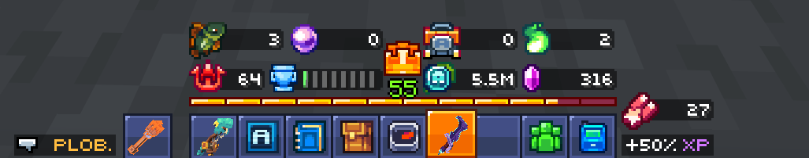

# Gnome
A utility mod for [MCC Island](https://mccisland.net) fishers

## Installation
For stable builds, you can get the mod over on [modrinth](https://modrinth.com/mod/gnome) or in the [releases tab](https://github.com/29cmb/Gnome/releases)

The latest build of the mod can always be found in the [actions tab](https://github.com/29cmb/Gnome/actions)

## Requirements
1. Minecraft [Fabric](https://fabricmc.net/) v26.1.2
2. [Yet Another Config Library](https://modrinth.com/mod/yacl) v3.9.4 for fabric
3. Any version of [Fabric Language Kotlin](https://modrinth.com/mod/fabric-language-kotlin)

## Features
### Day/Night notifications
Gives a chat notification and sound when it becomes night time

This plays a [**Ponder**](https://minecraft.wiki/w/File:Goat_Horn_Call0.ogg) goat horn when it becomes day, and a [**Sing**](https://minecraft.wiki/w/File:Goat_Horn_Call1.ogg) goat horn when it becomes night

In the mod config, you can disable either or both of them.

### Currents notifications
Sends a chat message and plays a sound when the currents change at the top of every hour

This plays a [**Seek**](https://minecraft.wiki/w/File:Goat_Horn_Call2.ogg) goat horn

### Fishing Session Statistics
A section above the hotbar that displays statistics about your current session. Among these are:
- Fish
- Pearls
- Treasure
- Spirits
- XP

> [!TIP]
> You can reset these statistics using the command `/gnome session reset`

There are 2 stat tracking modes
1. Catches Tracking - Tracks the amount of times you've caught a certain type. Ex: 4x pristine only increases the counter by 1
2. Amounts Tracking - Tracks the amount of items you've caught of a certain type. Ex: 4x pristine increases the counter 4 times

And for specifically pearls, you can configure what the counter shows
1. Catches - Counts all pearls as 1 point for the counter
2. Rough, Polished, Pristine - Counts each pearl tier relative to the selected mode. Ex: On pristine mode, a rough pearl makes the counter increase by 0.01, and a polished makes it increase by 0.1

### Misc
- A loud sound when you're about to be kicked to limbo for being AFK
- An option to hide private lobby advertisements

---
###### Not affiliated with or endorsed by Mojang or Noxcrew!